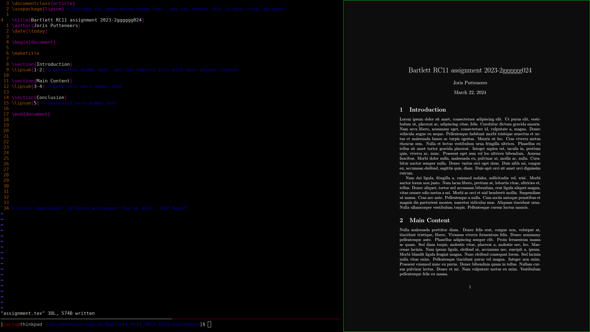

# archigrad configuration files.


These files have been succesfully tested on Ubuntu 22.04.2 LTS x86_64 machine.

## i3
A tiling window manager for Linux.

<details open>
<summary>i3 config file</summary>

	**Location:** ~/.config/i3/config

	**Changes:** Mostly color and theme adjustments.

	**Most Used Shortcuts:**
	- Alt + [1,2,3,...] : Change workspace
	- Alt + d : dmenu (used for commands, programs, etc)
	- Alt + hjkl : Switch active pane
	- Alt + shift + hjkl : Move active pane
	- Alt + shift + q : Kill active pane
	- Alt + shift + [1,2,3,...] : Move active pane to different workspace
	
</details>

## Qutebrowser
A keyboard-driven web browser based on Python and Qt.

<details open>
<summary>qutebrowser config file</summary>

	**Location:** ~/.config/qutebrowser/config.py

	**Changes:** Theme, shortcuts, startup file.

	**Most Used Shortcuts:**
	- Shift + [j,k] : Shift tabs
	- j, k : Scroll down/up
	- Shift + h,l : Go back and forth in history
	- f : Go to location

</details>

## Tmux
A terminal multiplexer that enables multiple sessions in a single terminal window.

<details open>
<summary>tmux config file</summary>

	**Location:** ~/.config/tmux/tmux.config

	**Changes:** Mostly color and theme adjustments, setup Vim keybindings in navigation, resizing.

	**Most Used Shortcuts:**
	- Move from one pane to another: Ctrl-s hjkl
	- Resize panes: Ctrl-s Ctrl hjkl
	- Create new panes: Ctrl-s % and Ctrl-s "
	- Make pane fullscreen: Ctrl-s z

	**Additional Functions:**
	- Tmux switch sessions: Ctrl-s s jk
	- Tmux new-session -s "my_session ": tmux n "my_session"
	- Tmux detach: tmux d
	- Tmux attach-session -t "my_session": tmux a "my_session"
	- Tmux kill-session -t "my_session": tmux k "my_session"
	- Tmux list-session: tmux ls
	
	- ctrl-s shift L --> previous or next workspace (really usefull)
</details>

## Vim
A highly configurable text editor known for its efficiency and extensive plugin ecosystem.

<details open>
<summary>vim config file</summary>

	
" backspace didint worjm nymore so thuis is a fix 
set backspace=indent,eol,start

" Turn syntax highlighting on.
syntax on

highlight StatusLine ctermfg=Black ctermbg=White
set statusline=%F%h%m%r%=%-14.(%l,%c%V%)\ %P

" Disable compatibility with vi which can cause unexpected issues.
set nocompatible

" Enable type file detection. Vim will be able to try to detect the type of file in use.
filetype on

" Enable plugins and load plugin for the detected file type.
"filetype plugin on

" Load an indent file for the detected file type.
"filetype indent on

" Turn syntax highlighting on.
syntax on

" Add numbers to each line on the left-hand side.
set number
set relativenumber

" add defualt colorscheme
color default


" Customize Vim split window divider
 set fillchars+=vert:\│
 highlight VertSplit cterm=NONE


" Color scheme for the status line
highlight statusLine   cterm=NONE ctermfg=darkGrey ctermbg=black
highlight StatusLineNC cterm=NONE ctermfg=black ctermbg=black


" Do not wrap lines. Allow long lines to extend as far as the line goes.
set nowrap

"
" Set the width of the text to 80 characters.

" set textwidth=80


" While searching though a file incrementally highlight matching characters as you type.
set incsearch

" Ignore capital letters during search.
set ignorecase

" Override the ignorecase option if searching for capital letters.
" This will allow you to search specifically for capital letters.
set smartcase

" Show partial command you type in the last line of the screen.
set showcmd

" Show the mode you are on the last line.
set showmode

" Show matching words during a search.
set showmatch

" Use highlighting when doing a search.
" set hlsearch

" Set the commands to save in history default number is 20.
set history=1000

" Enable auto completion menu after pressing TAB.
set wildmenu

" Make wildmenu behave like similar to Bash completion.
" set wildmode=list:longest


</details>

## Zsh
A powerful shell with advanced scripting capabilities, often used as an alternative to Bash.

<details open>
<summary>zsh config file</summary>

	**Location:** ~/.zshrc

	**Theme Location:** ~/.oh-my-zsh/.themes/alanpeabody.zsh-theme

	**Changes:** Theme, PIO integration, Houdini alias, Tmux integration.

	**Aliases:**
	```zsh
	# Houdini alias
	houdini(){
	    local current_dir=$(pwd)
	    cd /opt/hfs19.5
	    source houdini_setup
	    cd "$current_dir"
	    happrentice "$1"
	}

	# Tmux alias
	tmux() {
	    local arg1=""
	    local arg2=""
	    local arg3=""

	    if [ "$1" = "n" ]; then
		arg1="new-session"
		arg2="$2"
		arg3="-s"
	    fi

	    if [ "$1" = "d" ]; then
		arg1="detach"
	    fi

	    if [ "$1" = "k" ]; then
		arg1="kill-session"
		arg2="$2"
		arg3="-t"
	    fi

	    if [ "$1" = "a" ]; then
		arg1="attach-session"
		arg2="$2"
		arg3="-t"
	    fi

	    if [ -n "$arg1" ]; then
		if [ -n "$arg2" ] && [ -n "$arg3" ]; then
		    command tmux "$arg1" "$arg3" "$arg2"
		elif [ -n "$arg2" ]; then
		    command tmux "$arg1" "$arg2"
		else
		    command tmux "$arg1"
		fi
	    else
		command tmux "$@"
	    fi
	}

	# PlatformIO integration
	eval "$(_PIO_COMPLETE=zsh_source pio)"

</details>


## useful terminal tools

```shell 

feh - foog image viewer
mupdf - pdf viewer
grip - markdown viewer
```

make sure that if you tm -rf "somefile" that is is not deleted form system, but goes to trash bin in ~/.local/share/Trash/file

```shell
sudo apt-get install trash-cli
nano ~/.bashrc
alias rm='trash-put'
source ~/.bashrc


```

## terminal settings

```shell 

xset r rate 300 60 --> where 300 is the time in ms before the cursor start diuplicating symbols. 
60 is the speed of duplication  in ms

```

make sure that if you tm -rf "somefile" that is is not deleted form system, but goes to trash bin in ~/.local/share/Trash/file

```shell
sudo apt-get install trash-cli
nano ~/.bashrc
alias rm='trash-put'
source ~/.bashrc


```


## platofrmIO

on ubuntu i have had the problem that microcontrollers would not connect. 
de devide would be recognised as a usb devide, but would immediatly disconnect. this caused platformio to throw an error because it could not find the device

when typing in `sudo dmesg | grep ttyUSB` it would return that the microcontroller immedaitly was disconnected.
```shell
[ 1501.372532] usb 1-2: ch341-uart converter now attached to ttyUSB0
[ 1497.039622] ch341-uart ttyUSB0: ch341-uart converter now disconnected from ttyUSB0

```
what fixed this error was executing: 

```shell
sudo apt remove brltty
```


## make beuatifulkk pdf's with pdflatex and mupdf





to create a nice latex workenvironment, you can use the following alias in your .bashrc file.
it will compile the latex file and open it in mupdf but everytime you save the file, the pdf will be updated.

```shell
 alias compilepdf='pdflatex assignment.tex && pkill -HUP mupdf'

```


