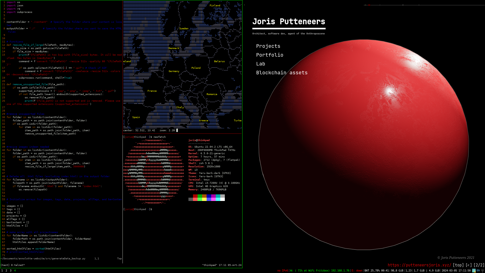

# archigrad configuration files.

These files have been succesfully tested on Ubuntu 22.04.2 LTS x86_64 machine.

## i3
A tiling window manager for Linux.

<details open>
<summary>i3 config file</summary>

	**Location:** ~/.config/i3/config

	**Changes:** Mostly color and theme adjustments.

	**Most Used Shortcuts:**
	- Alt + [1,2,3,...] : Change workspace
	- Alt + d : dmenu (used for commands, programs, etc)
	- Alt + hjkl : Switch active pane
	- Alt + shift + hjkl : Move active pane
	- Alt + shift + q : Kill active pane
	- Alt + shift + [1,2,3,...] : Move active pane to different workspace
	
</details>

## Qutebrowser
A keyboard-driven web browser based on Python and Qt.

<details open>
<summary>qutebrowser config file</summary>

	**Location:** ~/.config/qutebrowser/config.py

	**Changes:** Theme, shortcuts, startup file.

	**Most Used Shortcuts:**
	- Shift + [j,k] : Shift tabs
	- j, k : Scroll down/up
	- Shift + h,l : Go back and forth in history
	- f : Go to location

</details>

## Tmux
A terminal multiplexer that enables multiple sessions in a single terminal window.

<details open>
<summary>tmux config file</summary>

	**Location:** ~/.config/tmux/tmux.config

	**Changes:** Mostly color and theme adjustments, setup Vim keybindings in navigation, resizing.

	**Most Used Shortcuts:**
	- Move from one pane to another: Ctrl-s hjkl
	- Resize panes: Ctrl-s Ctrl hjkl
	- Create new panes: Ctrl-s % and Ctrl-s "
	- Make pane fullscreen: Ctrl-s z

	**Additional Functions:**
	- Tmux switch sessions: Ctrl-s s jk
	- Tmux new-session -s "my_session ": tmux n "my_session"
	- Tmux detach: tmux d
	- Tmux attach-session -t "my_session": tmux a "my_session"
	- Tmux kill-session -t "my_session": tmux k "my_session"
	- Tmux list-session: tmux ls
	
	- ctrl-s shift L --> previous or next workspace (really usefull)
</details>

## Vim
A highly configurable text editor known for its efficiency and extensive plugin ecosystem.

<details open>
<summary>vim config file</summary>

	**Location:** ~/.config/.vimrc

	**Changes:** Tabs, color.

	**Most Used Shortcuts:**
	- All shortcuts

	- viw -> select inner word
	- "0y -> yank to 0'th registery
	- "0p -> paste from 0'th registery

	some goes for viw -> "4y -> "4p  --> yank something to refister 4, and then paste it.


	- even better! we can copy to the clipboard registery by doing
	- this means we can quickly interact with other programs without doing ctrl c and ctrl v
	- make a selection -> v
	- "+y to copy to clipboard registery
	- "+p paste from clipboard registery 

</details>

## Zsh
A powerful shell with advanced scripting capabilities, often used as an alternative to Bash.

<details open>
<summary>zsh config file</summary>

	**Location:** ~/.zshrc

	**Theme Location:** ~/.oh-my-zsh/.themes/alanpeabody.zsh-theme

	**Changes:** Theme, PIO integration, Houdini alias, Tmux integration.

	**Aliases:**
	```zsh
	# Houdini alias
	houdini(){
	    local current_dir=$(pwd)
	    cd /opt/hfs19.5
	    source houdini_setup
	    cd "$current_dir"
	    happrentice "$1"
	}

	# Tmux alias
	tmux() {
	    local arg1=""
	    local arg2=""
	    local arg3=""

	    if [ "$1" = "n" ]; then
		arg1="new-session"
		arg2="$2"
		arg3="-s"
	    fi

	    if [ "$1" = "d" ]; then
		arg1="detach"
	    fi

	    if [ "$1" = "k" ]; then
		arg1="kill-session"
		arg2="$2"
		arg3="-t"
	    fi

	    if [ "$1" = "a" ]; then
		arg1="attach-session"
		arg2="$2"
		arg3="-t"
	    fi

	    if [ -n "$arg1" ]; then
		if [ -n "$arg2" ] && [ -n "$arg3" ]; then
		    command tmux "$arg1" "$arg3" "$arg2"
		elif [ -n "$arg2" ]; then
		    command tmux "$arg1" "$arg2"
		else
		    command tmux "$arg1"
		fi
	    else
		command tmux "$@"
	    fi
	}

	# PlatformIO integration
	eval "$(_PIO_COMPLETE=zsh_source pio)"

</details>


## terminal settings

```shell 

xset r rate 300 60 --> where 300 is the time in ms before the cursor start diuplicating symbols. 
60 is the speed of duplication  in ms

```

make sure that if you tm -rf "somefile" that is is not deleted form system, but goes to trash bin in ~/.local/share/Trash/file

```shell
sudo apt-get install trash-cli
nano ~/.bashrc
alias rm='trash-put'
source ~/.bashrc


```
